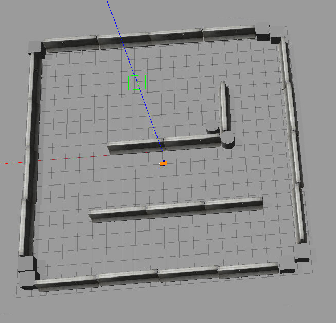
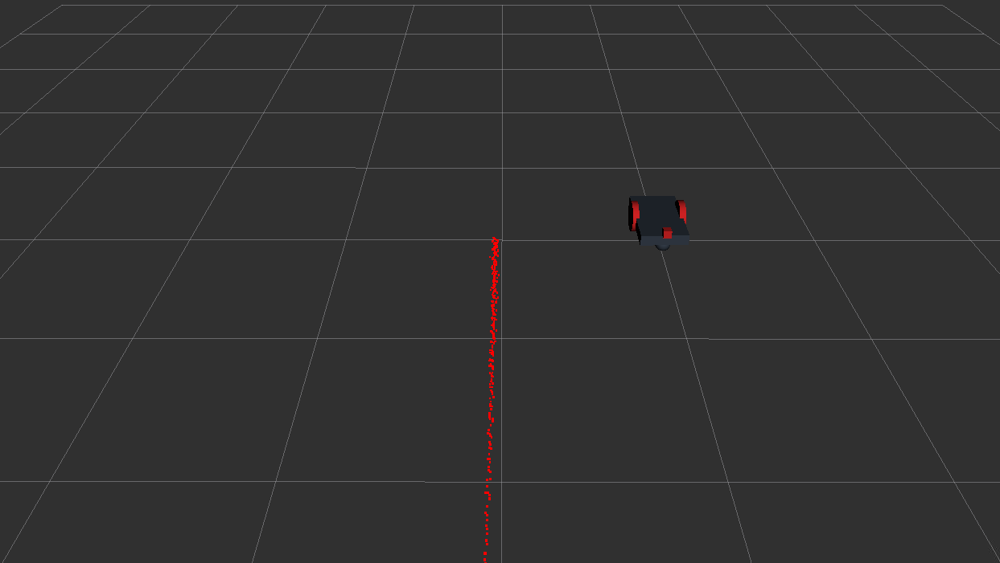

Second assignment
================================

The aim of this last assignment is to become more familiar with **ROS**, by developing three ( or four if you want) nodes of a given 3D **Gazebo** and **Rviz** simulation.
The four nodes consist in:

* A node that allows the user to set a goal position ( x, y coordinates) or cancell it;
* A node that publishes the current robot position ( x, y coordinates) and velocity ( x, y coordinates);
* A service node that prints the number of goals reached and cancelled;
* A node that prints the euclidian distance from the target, and its average speed;

In addition it is required to create **launch file**, which is used to start the whole program and, pass as parameters, the rate for printing the information of last node.

Installing and running
----------------------
For start the whole program, you have to do some several, but fundamental, step. First of all it is important to have **ROS noetic** version on your pc; the best simple suggestion is to have the [**Docker**](https://docs.docker.com/get-docker/) and then follow this [**ROS guide**](http://wiki.ros.org/ROS/Installation).

You can clone my repository by clicking on the terminal 

```git clone https://github.com/SimoBor99/Rt1_assignment2```

Once you have done that, you have to put the two pakages in your wokspace; on [wiki.ros.org](http://wiki.ros.org/catkin/Tutorials/create_a_workspace) you can find how can create your own workspace; then you have to put the two pakages, **assignment_2_2022** and **following_goal**, in your src workspace folder, and, inside the root of it, use the command ```catkin_make``` for building everything.\
If everything works properly, you can launch the simulation; you must launch firstly the action server, by writing on the terminal ```roslaunch assignment_2_2002 assignment1.launch```, and you can see the spawing of two windows: the **Gazebo** and **Rviz** window.

<table><tr>
  <td>  </td>
  <td>  </td>
</tr>
<tr>
   <td>Gazebo window</td>
   <td>Rviz window</td>
  </tr>
</table>
   
Now you can launch my program, by doing a similar thing: click on terminal ```roslaunch following_goal following_goal.launch```, and it is possible two see four windows; the only one with which you can interact is the one that tells you to choose one of the four options on the menu.

**Important remark**: before launching my launch file, it is important to install **xterm** terminal; you can do that by using the command ```apt-get install xterm``` on your docker terminal. 

## Pseudocode

For achieving what i have already explained before, I built four different nodes. Here I show the pseudocode for the first two: the node for setting the goal and publishing the current position.

* **Set goal node**
```
Function input:
  Pass as argument var answer
  No return values
  Print ""Options: 1) Set goal; 2) Cancell current goal; 3) Number of cancelled or reached goal; 4) Exit; Choose one of it"
  Insert var answer 
  RETURN var answer
  
Function number_goals:
  No arguments
  No return values
  Call waitForExistence method by object client;
  Invoke call method by object client, passing as argument the object svr1
  Assign srv1.response.reached to var reach
  Assign srv1.response.cancelled to var eliminate
  Print the var reach and eliminate
  
Function main:
  Call ros init function, with arguments argc, argv and "set_goal"
  Define a NodeHandle
  Create the action client, passing "/reaching_goal" and true
  Define var answer
  SET var set_goal to 0
  Define object goal
  Print "Waiting for action server to start"
  Call waitForServer method by action client
  WHILE ros ok function returns true:
    Call input function, passing as argument var answer
    Assign the return value of input function to var answer
    SET object state to the return value of method getState
    IF var set_goal is not 0 and the comparison between "SUCCEEDED" and object state returns 0:
      Assign set_goal-1 to var set_goal
    ENDIF
    SWITCH of var answer
      CASE when var answer is equal to 1:
        Assign the return value of getState method to state
        IF var set_goal is not 0 and the comparison between "SUCCEEDED" and object state does not return 0:
          Print "You have to delete a goal before setting a new one"
        ENDIF
        IF var set_goal is  to 0 and the comparison between "SUCCEEDED" and object state does not return 0:
          Assign set_goal-1 to var set_goal
        ENDIF
        ELSE IF var set_goal is 0:
          Print "Insert x, y position\n
          Insert var posx and posy
          Assign var posx to the attribute goal.target_pose.pose.position.x
          Assign var posy to the attribute goal.target_pose.pose.position.y
          Call the sendGoal method by action client, passing as argument the object goal
        END ELSEIF
       Call the sleep function with argument 1
       TERMINATE
       CASE when var answer is equal to 2:
         Assign the return value of getState method to object state
          IF the comparison between "SUCCEEDED" and object state does not return 0:
            Call cancellGoal method by action client
            Print "Goal has been cancelled"
            Assign set_goal-1 to var set_goal
          ENDIF
          ELSE: 
            Print "All goals have been cancelled: set new one, or exit"
          END ELSE
           Call sleep function with argument 1
          TERMINATE 
        CASE when var answer is equal to 3:
          Assign the return value of serviceClient method, passing as argument /result, to object client
          Call number_goals function
          Call sleep function with argument 1
          TERMINATE
        CASE when var answer is equal to 4:
          IF var set_goal is not 0:
            Call cancelGoal function by action client
          ENDIF
          EXIT
          TERMINATE
        DEFAULT
          Print "Choose something in the menu"
          Call sleep function with argument 1
     END SWITCH
     Call spinOnce function
  END WHILE
   
Global variables:
  Define var posx
  Define var posy
  Define var reach
  Define var eliminate

Global objects:
  Define object client 
  Define object srv1
```
* **Publisher node**
```
Function pos_v_Callback:
  Pass var msg as argument
  No return values
  Print "Robot pos and vel" and the values of attribute pose.pose.position.x, attribute pose.pose.position.y, attribute twist.twist.linear.x, attribute twist.twist.linear.y, accessed by var msg
  Assign attribute pose.pose.position.x, accesed by msg, to var posx
  Assign attribute pose.pose.position.y, accesed by msg, to var posy
  Assign attribute twist.twist.linear.x, accesed by msg, to var vx
  Assign attribute twist.twist.linear.y, accesed by msg, to var vy
  Define object pv
  Assign var posx to attribute pv.posx
  Assign var posy to attribute pv.posy
  Assign var vx to attribute pv.velx
  Assign var vy to attribute pv.vely
  Call publish method, passing as argument object pv
  
Function Main:
  Call ros init function, with arguments argc, argv and "robot_publisher"
  Define a NodeHandle
  Call subscribe method passing as argument "/odom", 1 and the function pos_v_Callback
  Assign the return value of it to object sub
  Call advertise method, passing as argument "/info_robot" and 1
  Assign the return value of it to object pub
  Call the method spin
  
 Global variables:
  Define var posx
  Define var posy
  Define var vx
  Define var vy
 
 Global objects:
  Define object pub
  ```
Possible improvements
-------------------------------------
It is possible to make some improvements to server and client side. Concerinig the **server side**, it could be better:
* Once the user has set the goal, see it on the Gazebo environment; for istance the goal could be a red or yellow spot in the area, or something else like that;
* Improving the bug 0 algorithm, because some times the robot reaches the corner of the wall, and is not able to move anymore unless you end the simulation or teleport it by using some options in Gazebo;

Concerning the **client side** it could be better:
* Making the set_goal node more modular; this means developing more functions for achieving the same purpouses, but I should pass the action client to the custome service, because in ROS I cannot declare the former as a global object;
* Giving the possibility to close not only the menu window when the user press exit, that means option 4 on the menu, but also the remaning others.


